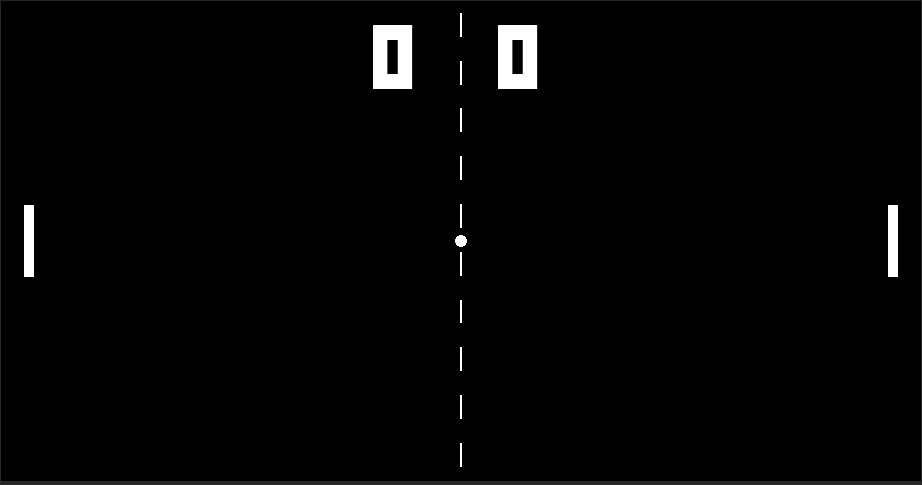

# Pong 2.0

Second edition of the Classic Pong game.

## Table of content :

[General Infos](#General-Infos)
[Technologies Used](#Technologies-Used)
[Composition](#Composition)
[Gameplay](#Gameplay)
### General Infos :

This is my second version of the Pong game. I recreated the game after making major modifications to its structure. Using different methods to cover game control and fluent techniques.

### Technologies Used :

The major technologies used :

- UnityEngine 21.3.7f1
- UnityEngine EventSystem
- UnityEngine UI
- Csharp OOP

### Composition :

In this project, i used basec C# OOP paradigmes to better orgonise the game's logic.
Used simple Prefabs, a Linerender, RigideBody2D,2D Colliders, Cooler fonts and eventsystem to make a fluent game experience.
### Gameplay :
The player will try to score against the machine (a simple AI) while the ball's speed increases with each collision.
